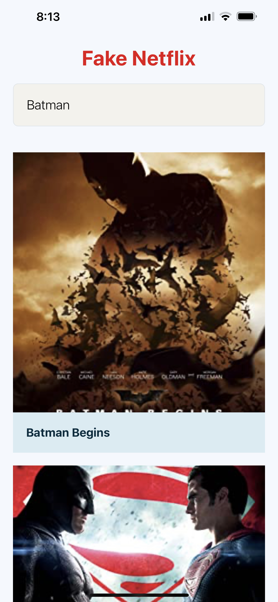
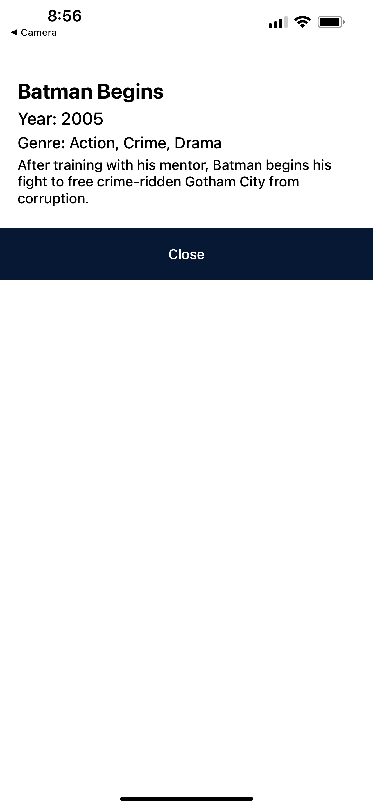

### APIs

- [OMDb](http://www.omdbapi.com/)

## Running locally

As others projects, you will need some requirements to run:

#### Requirements

- [Node.js](https://nodejs.org/) (latest)
- [Expo](https://expo.io/) (latest)
- [NPM](https://docs.npmjs.com/downloading-and-installing-node-js-and-npm) (latest)

#### How to run

- `git clone git@github.com:murillo94/cine-the-guide-movie.git`
- `npm install`